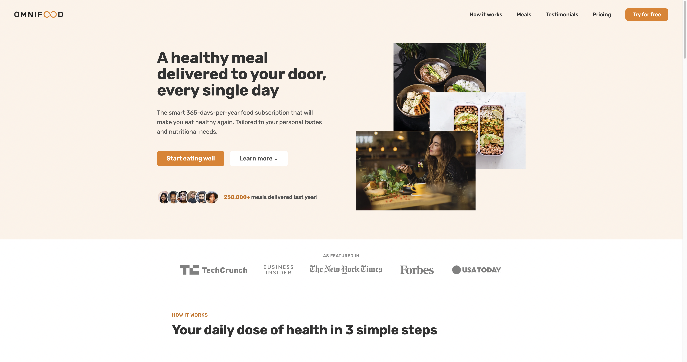
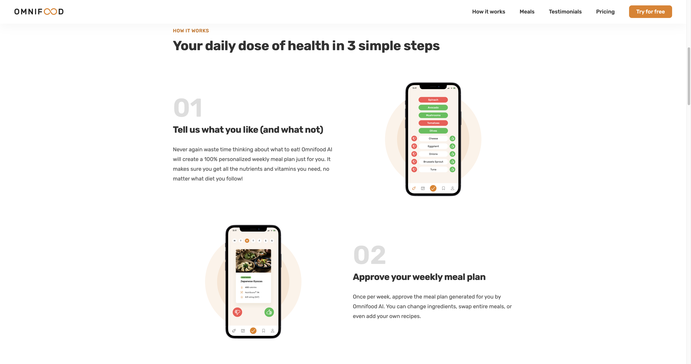

# OMNIFOOD

## Overview
[Omnifood](https://uche-jordy-omnifood.netlify.app/) is a responsive web application designed for a fictional food subscription service. This project showcases a blend of advanced web development techniques and artificial intelligence to deliver custom healthy meal plans.

## Technical Highlights
- **Responsive Design**: Crafted using HTML and CSS Flexbox and Grid, ensuring optimal user experience across various devices.
- **Interactive UI**: Features a dynamic navigation bar and image scaling effects on hover, enhancing visual appeal and user engagement.
- **User Engagement**: Includes a streamlined sign-up form, facilitating easy user onboarding.

## Goals and Audience
- **Business Goal**: Facilitating the sale of monthly food subscriptions through an engaging online presence.
- **User Goal**: Providing busy, health-conscious professionals with an effortless solution to nourish their bodies.
- **Target Audience**: Aimed at technology lovers and professionals who value a healthy diet and convenience.

## Explore Omnifood
Experience the interface and functionalities of Omnifood by visiting the [live site](https://uche-jordy-omnifood.netlify.app/). 

## Repository
For more details on the codebase and contributions, visit the [Omnifood GitHub Repository](https://github.com/UniLife-Projects/Omnifood-Project.git).

## About the Developer
Developed by [Jordy Uche](https://github.com/UniLife-Projects), a passionate software engineer focused on creating innovative web solutions.

---
© 2023 Omnifood. All Rights Reserved.

