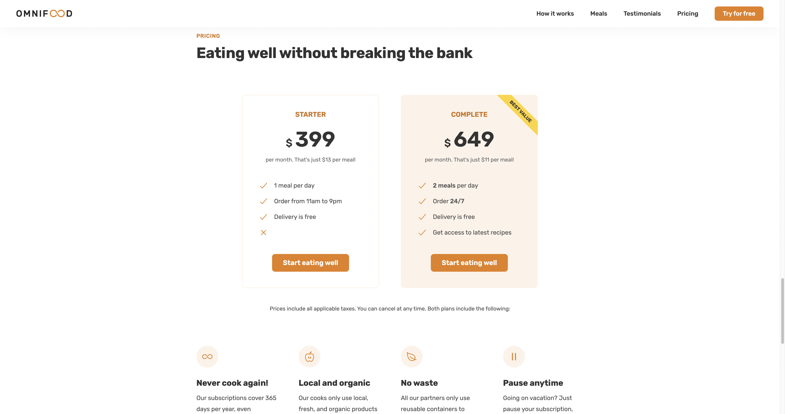

# OMNIFOOD

## I built a responsive website for a fictional company called [Omnifood](https://uche-jordy-omnifood.netlify.app/)

---

> [Omnifood](https://uche-jordy-omnifood.netlify.app/) is a startup company that utilises Artificial Intelligence Technology to build and distribute custom healthy meal plans.

---

###### WHO website is for

> [Omnifood](https://uche-jordy-omnifood.netlify.app/) company is the client

---

###### WHAT website if for

**Business Goal:** Sell monthly food subscriptions
**User Goal:** Nourish the body effortlessly with minimal money and effort spent

---

###### Target Audience

- [x] Technology Lovers
- [x] Busy people
- [x] Love healthy diet
- [ ] ~~Love poor diet~~
- [x] Have a well-paying job
- [ ] ~~Low paying job~~

---

## How To Use

> To view, click [here](https://uche-jordy-omnifood.netlify.app/), OR on any image, OR download files and open HTML file.     
